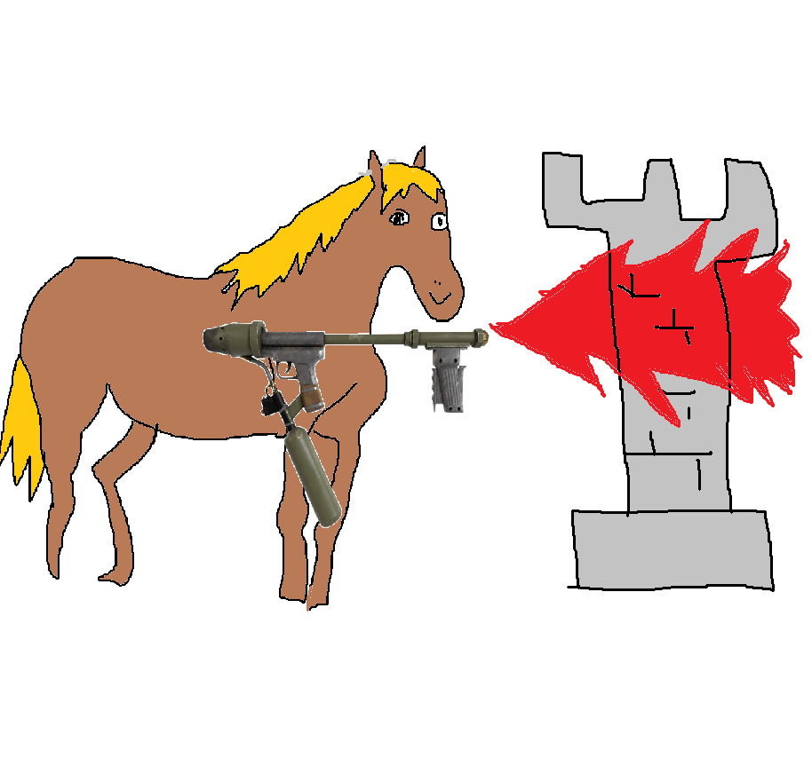
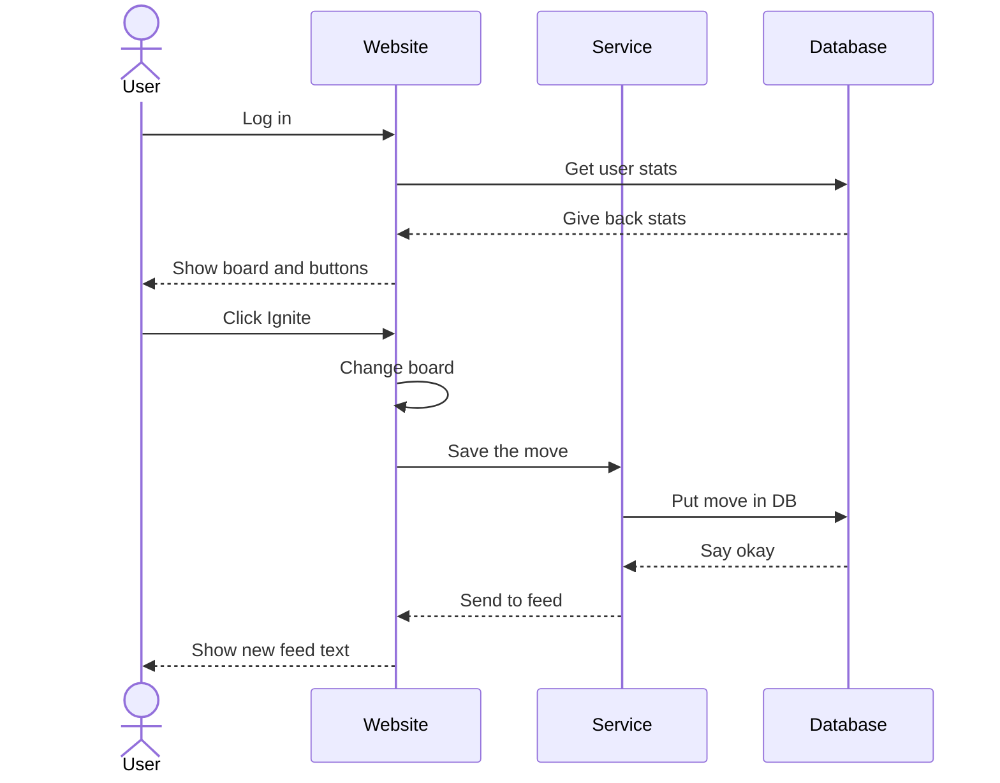

# Echo Ignition

[My Notes](notes.md)

This is a chess game app where you play on a grid, use special moves, and hit things. You can log in, look at your stats, and solve chess puzzles.

### Elevator pitch

Normal chess gets boring when people take forever to move. Echo Ignition adds buttons like "Echo" and "Ignite" so you can blow stuff up instead of just waiting around. It also has a live feed and daily puzzles.

### Design

### Key features

- A chess board with health numbers on pieces
- Buttons for special moves like Echo and Ignite
- A box that shows live messages using WebSockets
- A stats page that shows if you are winning or losing
- A button that gets a daily puzzle from Lichess

### Technologies

I am going to use the required technologies in the following ways.

- **HTML** - HTML will be the basic structure for the program, for the cards, containers, forms and other elements
- **CSS** - CSS will be for the visual elements of the website and organize where things go
- **React** - React will make the website interactive and allow the creation of cards and moving them
- **Service** - Service is for managing communications between the website and databases for info
- **DB/Login** - Will be used to store info so that the user can log on and off and have things saved
- **WebSocket** - Websocket will make the page update when changes are made
- **3rd Party API** - Dicebear will be used to generate images for employees without photos

## 🚀 Specification Deliverable

> [!NOTE]
> Fill in this sections as the submission artifact for this deliverable. You can refer to this [example](https://github.com/webprogramming260/startup-example/blob/main/README.md) for inspiration.

For this deliverable I did the following. I checked the box `[x]` and added a description for things I completed.

- [x] I completed the prerequisites for this deliverable (Git commit requirement)
- [x] Proper use of Markdown
- [x] A concise and compelling elevator pitch
- [x] Description of key features
- [x] Description of how you will use each technology including your 3rd party API and use of WebSocket
- [x] One or more rough sketches of your application. Images must be embedded in this file using Markdown image references.

## 🚀 AWS deliverable

For this deliverable I did the following. I checked the box `[x]` and added a description for things I completed.

- [x] **Rented EC2 server** - I completed this part of the deliverable.
- [x] **Leased domain name** - I completed this part of the deliverable.
- [x] **Server accessible** from my domain: [https://echoignition.click/](https://echoignition.click/) - I completed this part of the deliverable.

## 🚀 HTML deliverable

For this deliverable I did the following. I checked the box `[x]` and added a description for things I completed.

- [x] I completed the prerequisites for this deliverable (Simon deployed, GitHub link, Git commits)
- [x] **HTML pages** - I made 4 pages, the homepage, a play page, a help page and a stats page.
- [x] **Proper HTML element usage** - I used HTML to make things.
- [x] **Links** - There are buttons that lead to each page at the bottom of each page.
- [x] **Text** - There is text. Not meaningful text, but there is text.
- [x] **3rd party API placeholder** - On the play page, i put a button that will lead to a daily chess puzzle using the Lichess daily puzzle api.
- [x] **Images** - I created a masterpiece for my placeholder logo.
- [x] **Login placeholder** - There is a placeholder login on the landing page.
- [x] **DB data placeholder** - The stats page will contain play stats based on what you have done.
- [x] **WebSocket placeholder** - On the play page, there is a live feed for what's going on.

## 🚀 CSS deliverable

For this deliverable I did the following. I checked the box `[x]` and added a description for things I completed.

- [ ] I completed the prerequisites for this deliverable (Simon deployed, GitHub link, Git commits)
- [ ] **Visually appealing colors and layout. No overflowing elements.** - I did not complete this part of the deliverable.
- [ ] **Use of a CSS framework** - I did not complete this part of the deliverable.
- [ ] **All visual elements styled using CSS** - I did not complete this part of the deliverable.
- [ ] **Responsive to window resizing using flexbox and/or grid display** - I did not complete this part of the deliverable.
- [ ] **Use of a imported font** - I did not complete this part of the deliverable.
- [ ] **Use of different types of selectors including element, class, ID, and pseudo selectors** - I did not complete this part of the deliverable.

## 🚀 React part 1: Routing deliverable

For this deliverable I did the following. I checked the box `[x]` and added a description for things I completed.

- [ ] I completed the prerequisites for this deliverable (Simon deployed, GitHub link, Git commits)
- [ ] **Bundled using Vite** - I did not complete this part of the deliverable.
- [ ] **Components** - I did not complete this part of the deliverable.
- [ ] **Router** - I did not complete this part of the deliverable.

## 🚀 React part 2: Reactivity deliverable

For this deliverable I did the following. I checked the box `[x]` and added a description for things I completed.

- [ ] I completed the prerequisites for this deliverable (Simon deployed, GitHub link, Git commits)
- [ ] **All functionality implemented or mocked out** - I did not complete this part of the deliverable.
- [ ] **Hooks** - I did not complete this part of the deliverable.

## 🚀 Service deliverable

For this deliverable I did the following. I checked the box `[x]` and added a description for things I completed.

- [ ] I completed the prerequisites for this deliverable (Simon deployed, GitHub link, Git commits)
- [ ] **Node.js/Express HTTP service** - I did not complete this part of the deliverable.
- [ ] **Static middleware for frontend** - I did not complete this part of the deliverable.
- [ ] **Calls to third party endpoints** - I did not complete this part of the deliverable.
- [ ] **Backend service endpoints** - I did not complete this part of the deliverable.
- [ ] **Frontend calls service endpoints** - I did not complete this part of the deliverable.
- [ ] **Supports registration, login, logout, and restricted endpoint** - I did not complete this part of the deliverable.
- [ ] **Uses BCrypt to hash passwords** - I did not complete this part of the deliverable.

## 🚀 DB deliverable

For this deliverable I did the following. I checked the box `[x]` and added a description for things I completed.

- [ ] I completed the prerequisites for this deliverable (Simon deployed, GitHub link, Git commits)
- [ ] **Stores data in MongoDB** - I did not complete this part of the deliverable.
- [ ] **Stores credentials in MongoDB** - I did not complete this part of the deliverable.

## 🚀 WebSocket deliverable

For this deliverable I did the following. I checked the box `[x]` and added a description for things I completed.

- [ ] I completed the prerequisites for this deliverable (Simon deployed, GitHub link, Git commits)
- [ ] **Backend listens for WebSocket connection** - I did not complete this part of the deliverable.
- [ ] **Frontend makes WebSocket connection** - I did not complete this part of the deliverable.
- [ ] **Data sent over WebSocket connection** - I did not complete this part of the deliverable.
- [ ] **WebSocket data displayed** - I did not complete this part of the deliverable.
- [ ] **Application is fully functional** - I did not complete this part of the deliverable.
